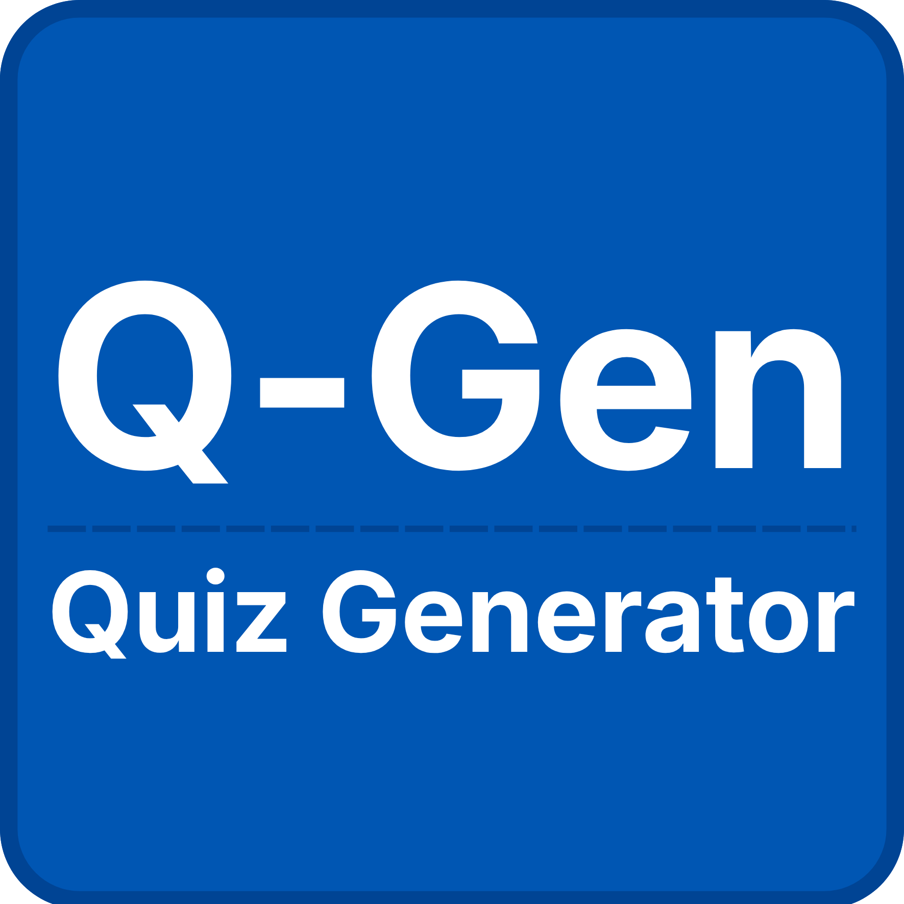

<div align="center">
  
  <h1>Q-Gen (Quiz Generator)</h1>
  <p><b>"Instant Exams, Zero Burnout"</b></p>
  
  
  
  
  
</div>

---

## 📌 Tentang Q-Gen

**Q-Gen** adalah solusi kecerdasan buatan (AI) yang dirancang khusus untuk membantu dosen dan guru. Aplikasi ini mengonversi materi pembelajaran terhubung dengan Google Drive dan konteks instruksi tambahan menjadi kuis atau ujian yang siap pakai hanya dalam hitungan detik. 

Kami memahami bahwa waktu pendidik sangat berharga; Q-Gen hadir untuk meringankan beban administratif dan mencegah _burnout_, sehingga pendidik dapat fokus pada misi utamanya: **mengajar dan mendidik**.

## 🎯 Permasalahan yang Diselesaikan

Pembuatan instrumen penilaian (kuis dan ujian) merupakan beban administrasi harian yang sangat menyita waktu bagi para pendidik. Proses manual yang harus dilalui—mulai dari membaca literatur ekstensif, menyusun pengecoh pilihan ganda (*distractors*) yang valid, hingga memastikan kesesuaian dengan standar kompetensi—kerap kali memicu fenomena *burnout* di kalangan pengajar.

Selain itu, kendala sekunder sering muncul: materi pembelajaran tersebar dan tersimpan di dalam repositori *cloud* (seperti Google Drive) tanpa adanya sistem ekstraksi cerdas. Akibatnya, pendidik menghabiskan lebih banyak waktu dan energi untuk rutinitas administratif ketimbang fokus pada peningkatan kualitas pembelajaran.

## 💡 Solusi & Keefektifan Q-Gen

Dengan slogan **"Instant Exams, Zero Burnout"**, Q-Gen dirancang sebagai SPA (*Single Page Application*) performa tinggi yang menghilangkan pekerjaan merepotkan ini melalui keunggulan berikut:

- **Integrasi Google Drive Langsung:** Pendidik cukup menempelkan tautan dokumen (Docs, Slides, PDF) tanpa harus menyalin teks panjang secara manual. Q-Gen menerapkan *recursive folder reading* untuk merayapi sub-folder dan mengekstrak materi besar secara otomatis.
- **Mesin AI Berstandar Pedagogi:** Ditenagai oleh **Gemini 3.1 Pro** yang dibekali *System Instruction* pedagogis ketat, Q-Gen mampu menyusun soal berdasarkan Taksonomi Bloom (tingkat C2 hingga C4/HOTS). AI ini juga diperintahkan khusus untuk menciptakan *smart distractors* (pengecoh cerdas yang logis), meminimalkan waktu revisi guru.
- **Siap Ujian & Ekspor Seketika:** Kuis secara otomatis dapat diekspor ke dalam format standar LMS murni (AIKEN Moodle) atau divaluasi ke dalam cetak PDF rapi (termasuk Kunci Jawaban). Siklus dari materi mentah menjadi alat evaluasi siap pakai dapat diselesaikan terhitung dalam hitungan detik.

## 🌟 Keunikan Utama (Uniqueness)

Keunikan arsitektur Q-Gen difokuskan pada *Zero-Server Database* dan kepatuhan absolutnya pada kebutuhan ekosistem pendidikan di dunia nyata:

- **Deep Integration & Recursive Reading:** Berbeda dengan generator AI generik yang sekadar menerima teks *copy-paste* pendek, Q-Gen dirancang memroses struktur folder Google Drive secara rekursif atas dokumen multi-halaman berkapasitas besar.
- **Format AIKEN Murni (Tanpa "Fluff"):** Q-Gen menghasilkan ragam output format AIKEN yang sangat presisi dan bersih dari teks deko/basa-basi pengantar teks AI. Ini menjamin *file* *txt* hasil ekspor dapat di-*import* utuh ke LMS (Moodle) kampus/sekolah tanpa riwayat risiko *error parsing*.
- **Library Persistence Berbasis Cloud User:** Pustaka soal (*history*) ini berbasiskan preferensi pengguna, file diunduh ke bentuk *json* statis, menjamin privasi material pendidik di bawah keutuhan sesi, memastikan modifikasi lebih dapat dikontrol.

## 🗂️ Kategori Aplikasi

Q-Gen diklasifikasikan dalam kategori **Education (Pendidikan)** sebagai pilar utamanya, serta menyentuh secara krusial kategori **Productivity (Produktivitas)**, mengingat landasan utamanya untuk menghemat siklus rotasi durasi kerja sekaligus mengeliminasi kelelahan mental (*burnout*) pendidik.

## ✨ Fitur Utama

- 📂 **Integrasi Tautan Google Drive**: Mendukung penempatan tautan Google Docs, Slides, maupun PDF yang secara cerdas mengekstrak judul file menggunakan Google OAuth (Google Drive API).
- 🧠 **Mesin AI Gemini 2.5 Flash**: Menghasilkan pertanyaan bermutu tinggi yang mematuhi standar pedagogi berbasis **Taksonomi Bloom** menggunakan parameter Prompting terstruktur (Zero and Few-shot prompting).
- 📤 **Ekspor Multiformat**: 
  - **AIKEN**: Format teks mentah yang siap diimpor ke dalam *Learning Management System* (LMS) seperti Moodle.
  - **PDF Profesional**: Lembar soal yang diformat secara rapi, elegan, dan dilengkapi dengan halaman khusus Kunci Jawaban.
  - **Esai**: Soal uraian terbuka dengan panduan/rubrik penilaian singkat.
- ⌨️ **Aksesibilitas / Shortcut Keyboard Cepat**: Aplikasi dilengkapi alur kendali menggunakan *keyboard shortcuts* (`Ctrl+Enter` untuk menambah tautan, `Ctrl+G` untuk Generate), mempersingkat iterasi kinerja Dosen.
- 🌓 **Dukungan Dark Mode**: Perlindungan mata dan antarmuka premium (Light & Dark theme), menggunakan Tailwind CSS untuk transisi visual halus (*delightful*).
- 📝 **Editor Markdown Bawaan**: Melihat dan menyesuaikan secara langsung hasil kuis dalam *Markdown Editor* yang bersih sebelum diekspor.

## 🚀 Cara Penggunaan

Alur kerja di Q-Gen sangatlah intuitif dan sederhana:

1. **🔑 Login (Opsional)**: Masuk menggunakan kredensial Google Anda untuk mengaktifkan akses pratinjau judul link secara realtime dari Google Drive. Bisa juga digunakan sebagai *Guest*.
2. **🔗 Paste Link Drive**: Masukkan tautan (URL) ke materi acuan Anda.
3. **⚙️ Atur Parameter**: Tentukan jumlah soal yang diinginkan, pilih format *output* ujian, dan lengkapi dengan instruksi spesifik. (Bisa menggunakan shortcut `Ctrl+Enter` dan `Ctrl+G`).
4. **✨ Generate**: AI Gemini akan memicu alur data secara *stream* interaktif (*loading spinner* & efek *glow animation*) menyiapkan pertanyaan terbaik untuk Anda.
5. **🔽 Export & Edit**: Anda dapat membaca hasilnya format dokumen maupun menyesuaikannya di Editor.

## 🛠️ Build & Instalasi (Lokal)

Untuk menjalankan Q-Gen di *environment* lokal Anda, ikuti langkah berikut:

**1. Clone Repositori**
```bash
git clone https://github.com/ahmadngiliyun00/q-gen.git
cd q-gen
```

**2. Instal Dependensi**
Gunakan `npm` untuk menginstal dependensi:
```bash
npm install
```

**3. Konfigurasi Environment**
Buat file bernama `.env` di *root directory* proyek Anda dan lengkapi konfigurasi API berikut:
```env
VITE_GEMINI_API_KEY=your_gemini_api_key_here
```

**4. Jalankan Development Server**
```bash
npm run dev
```
(Server akan berjalan dengan *Vite tooling* secara default)

## 💻 Teknologi yang Digunakan

| Kategori | Teknologi Utama |
| :--- | :--- |
| **Frontend Framework** | React, TypeScript, Vite |
| **Desain & Styling** | Tailwind CSS, Lucide React, Motion (Framer Motion) |
| **Pemrosesan (AI)** | @google/genai SDK (Gemini-2.5-flash) |
| **Otentikasi & Sumber Data** | Google Drive API, Google Identity Services OAuth 2.0 |
| **Parser Markdown** | React Markdown |

## 👨‍💻 Dibuat Oleh

<a href="https://www.linkedin.com/in/ahmadngiliyun00/" target="_blank">
  
</a>

> Dikembangkan dengan penuh semangat oleh **Ahmad Ngiliyun**. Didedikasikan bagi para pendidik pahlawan tanpa tanda jasa.

## 📄 Lisensi

Proyek ini didistribusikan di bawah **Lisensi MIT**. 

Hak Cipta (c) 2026 Ahmad Ngiliyun.  
*Silakan menggunakan, menyalin, memodifikasi, menggabungkan, menerbitkan, mendistribusikan, mensublisensikan, dan/atau menjual salinan perangkat lunak ini sesuai dengan syarat Lisensi MIT.*
